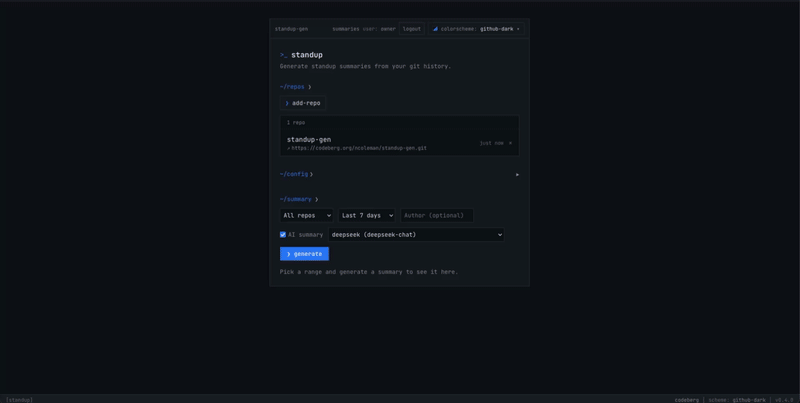

# surgite

Standup summaries from your git history — in the browser, in the terminal, or as a shareable link.

[](LICENSE)
<!-- TODO slice 4: add a build-status badge once the forgejo workflow runs on a public host -->

The web app gives your team a shared dashboard: per-user repos, per-user prompt
settings, AI-written summaries, and shareable links to specific summary views.
The CLI does the same for a local repo, no server needed. First-party auth,
no third-party tracking.

Lean principles: ~15 Python source files, one binary, no SPA framework, no
slowapi, no Celery, no Redis. Reads like a script.

## Quickstart

Two paths. Pick one.

**The web app** — three commands, full team dashboard:

```bash
git clone https://github.com/nicoleman0/surgite.git
cd surgite
cp .env.example .env       # set BOOTSTRAP_OWNER_EMAIL=you@example.com
docker compose up -d
```

On first start the app mints an admin invite and logs the token; redeem it
with `uv run surgite --redeem-invite <token> --email you@example.com` and
you're in. Full guide: [`docs/self-host.md`](docs/self-host.md).

**One-off summary from a local repo** — no database, no server:

```bash
uv tool install .
surgite /path/to/your/repo --since 7.days.ago
```

Add `--summarize` to get AI-written prose (set `ANTHROPIC_API_KEY` first).

## Screenshots



The dashboard, with terminal-aesthetic chrome, a sample repo's commit log,
and a streamed AI summary panel. See [`docs/self-host.md`](docs/self-host.md)
for the deployment walkthrough.

## What you get

- **Web dashboard** — per-user repos, prompt settings, summary history, share
  links, admin user management (`/admin/users`). Email + password login with
  `__Host-` session cookies.
- **CLI** — `surgite /path/to/repo` for a local one-off, `surgite --registered
  <name>` to pull from a running API, `surgite --login` to authenticate,
  `surgite --summarize` for AI-written prose.
- **Per-user provider keys** — each user brings their own Anthropic / Groq /
  DeepSeek key. Fernet-encrypted at rest, never returned by the API.
- **Shareable summary links** — `POST /summaries` mints a `/s/{slug}` URL that
  re-runs a saved query in a read-only view. Owner-scoped in multi-user mode.

## Why?

- **Multi-user** — email + password login, per-user repos and summaries,
  per-user provider keys. (The 0.5.0 headline.)
- **Self-hostable** — your data, your auth, your machine. No SaaS account, no
  vendor lock-in. Runs on a homelab box, a small VM, a Raspberry Pi, or a
  Kubernetes cluster — same code path.
- **No telemetry** — first-party auth, no analytics, no phone-home.
- **Lean** — FastAPI + Postgres + SvelteKit, the whole thing reads
  top-to-bottom.

## Documentation

- [`docs/self-host.md`](docs/self-host.md) — end-to-end self-hosting guide
  (sizing, quickstart, TLS, backup, runbook).
- [`docs/security.md`](docs/security.md) — the threat model and the security
  controls.
- [`docs/api-stability.md`](docs/api-stability.md) — the API stability policy:
  what we promise not to break, and how deprecation works.
- [`docs/security-support.md`](docs/security-support.md) — supported versions,
  the vulnerability-response SLA, and the advisory process.
- [`docs/openapi.json`](docs/openapi.json) — the snapshot-tested OpenAPI
  document; the machine-readable API contract.
- [`docs/migrations/0.4.0-to-0.5.0.md`](docs/migrations/0.4.0-to-0.5.0.md) —
  upgrading a 0.4.0 install.
- [`.env.example`](.env.example) — every configuration variable, with
  defaults.
- [`CHANGELOG.md`](CHANGELOG.md) — release history.

## Development

```bash
uv sync --group dev                 # install deps (incl. dev tools)
docker compose up -d db             # Postgres for local dev
uv run alembic upgrade head         # run migrations
uv run uvicorn surgite.api:app --reload
cd frontend && npm install && npm run dev
uv run pytest                       # tests
uv run ruff check . && uv run ruff format --check .   # lint + format
```

See [`AGENTS.md`](AGENTS.md) for the canonical dev quickstart and the
architecture overview.

## Contributing

Contributions are welcome. The project is deliberately minimalist — see the
principles in [`AGENTS.md`](AGENTS.md). Start with
[`CONTRIBUTING.md`](CONTRIBUTING.md) for dev setup and the PR workflow; please
also read [`CODE_OF_CONDUCT.md`](CODE_OF_CONDUCT.md). For anything
security-sensitive, see [`SECURITY.md`](SECURITY.md).

The canonical repository is on GitHub:
<https://github.com/nicoleman0/surgite>.

## License

[MIT](LICENSE) © 2026 Nick Coleman
