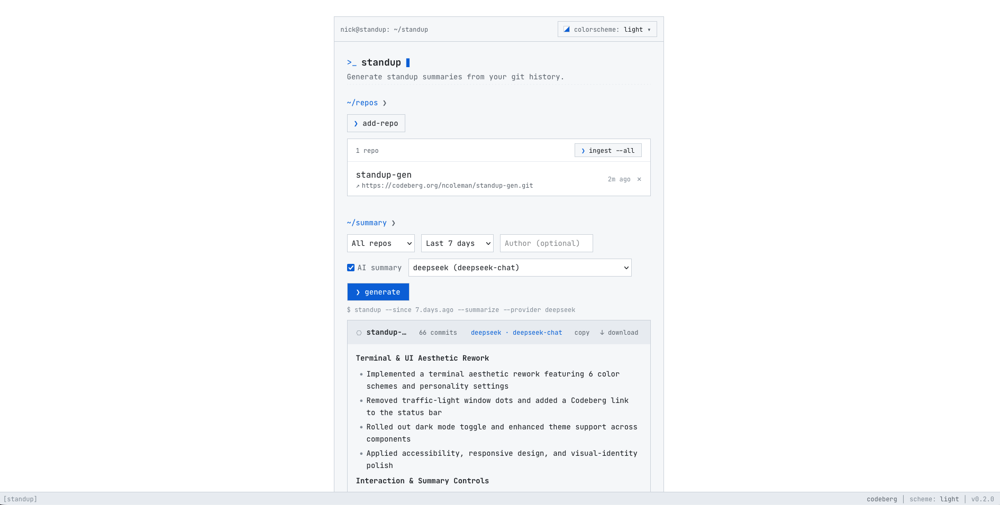
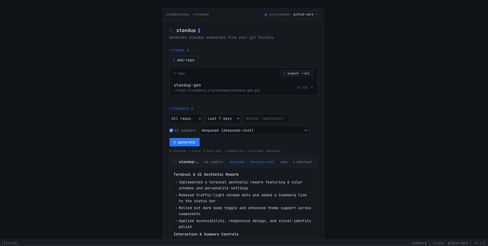

# standup-gen

Generate standup summaries from your git commit history — as a plain formatted log
or an AI-written prose summary. Use it as a one-off CLI, or self-host the small web
app to register repos, ingest commits on a schedule, and grab a copy-pasteable daily
or weekly summary from the browser.

[](LICENSE)


<p align="center">
  
  
</p>

## What it is

Three layers that build on each other; the CLI stays first-class and works on its own:

| Layer | What it does | Status |
| --- | --- | --- |
| **CLI** (`standup`) | Point it at a git repo, get a formatted log or an AI prose summary. No database required. | Working |
| **REST API** (FastAPI + Postgres) | Ingests commits into a `commits` table, exposes filterable read + summary endpoints, and CRUD for registered repos. | Working |
| **Web UI** (SvelteKit) | Register repos, trigger ingests, and generate standup summaries from the browser — light/dark themed. Served same-origin by the API. | Working |

## Quickstart (self-hosted web app)

Runs Postgres + the API + the bundled web UI with one command.

```bash
git clone https://codeberg.org/ncoleman/standup-gen.git
cd standup-gen
cp .env.example .env          # optional: add a provider key for AI summaries
docker compose up --build
```

Then open <http://localhost:8000>. Migrations run automatically on startup.

The app works **without** an LLM key — you'll get formatted commit logs and
non-AI summaries. Add a provider key to `.env` (see [Configuration](#configuration))
to enable AI-written prose summaries.

## CLI (standalone)

The CLI needs no database or server.

1. Install [uv](https://docs.astral.sh/uv/):

   ```bash
   curl -LsSf https://astral.sh/uv/install.sh | sh
   ```

2. Install `standup` as a global command:

   ```bash
   git clone https://codeberg.org/ncoleman/standup-gen.git
   cd standup-gen
   uv tool install .
   uv tool update-shell   # adds uv's tool bin to PATH (once); restart your shell after
   ```

3. (Optional) For AI summaries, set a provider key — e.g. in `~/.zshrc`:

   ```bash
   export ANTHROPIC_API_KEY=your_key_here
   ```

Usage:

```bash
standup /path/to/your/repo --since 1.day.ago --summarize
```

| Flag | Default | Description |
| ---- | ------- | ----------- |
| `repo_path` | *(required)* | Path to the git repository |
| `--since` | `7.days.ago` | How far back to look |
| `--until` | `now` | End of the range |
| `--author` | *(none)* | Filter to a specific author |
| `--since-commit` | *(none)* | Range starting from a given commit |
| `--summarize` | off | Use AI to write a prose summary (needs a provider key) |
| `--output` | *(stdout)* | Write output to a file instead |
| `--registered` | *(none)* | Pull a repo registered in a running standup-gen API instead of a local path (see below) |

Instead of a local path you can point the CLI at a running standup-gen
instance and reuse a repo it already ingested:

```bash
export STANDUP_API_URL=http://localhost:8000   # default
export STANDUP_API_TOKEN=...                   # only if your instance is behind a token
standup --registered my-repo --since 2026-06-01 --summarize
```

## Configuration

Set these in `.env` (web app) or your shell (CLI). Only the provider you actually use
needs a key.

| Variable | Default | Notes |
| --- | --- | --- |
| `DATABASE_URL` | derived from `POSTGRES_*` | Full SQLAlchemy URL. If unset, built from the `POSTGRES_*` vars below. |
| `POSTGRES_HOST` / `_PORT` / `_USER` / `_PASSWORD` / `_DB` | `db` / `5432` / `standup` / `standup` / `standup` | Used to assemble `DATABASE_URL` when it isn't set directly. |
| `LLM_PROVIDER` | `anthropic` | Summary provider: `anthropic`, `groq`, or `deepseek`. |
| `ANTHROPIC_API_KEY` / `GROQ_API_KEY` / `DEEPSEEK_API_KEY` | *(none)* | Key for the chosen provider; required for `--summarize` and `GET /summary?ai=true`. |
| `ANTHROPIC_MODEL` / `GROQ_MODEL` / `DEEPSEEK_MODEL` | per-provider | Optional model overrides (defaults: `claude-haiku-4-5-20251001`, `llama-3.1-8b-instant`, `deepseek-chat`). |
| `STANDUP_USER` | `the developer` | Name injected into the summary prompt. |
| `STANDUP_ROLE` | *(none)* | Optional role description appended to the prompt identity. |
| `API_HOST` / `API_PORT` | `127.0.0.1` / `8000` | Where the API binds. |
| `INGEST_INTERVAL` | `300` | Seconds between automatic background ingests of registered repos. Set to `0` to disable. |
| `REPO_CACHE_DIR` | `/var/standup/repos` | Where the app clones registered repos for ingest. |
| `LOG_LEVEL` | `INFO` | Root logger level. |
| `LOG_FORMAT` | *(human-readable)* | Set to `json` for structured logs. |
| `RATE_LIMIT_REQUESTS` | `5` | Max `/summary?ai=true` requests per IP per window. |
| `RATE_LIMIT_WINDOW_SECONDS` | `60` | Rate-limit window. |
| `SHARE_TTL_DAYS` | `7` | Lifetime of a shared-summary `/s/<slug>` link. |
| `STANDUP_API_URL` | `http://localhost:8000` | API the CLI's `--registered` mode talks to. |
| `STANDUP_API_TOKEN` | *(none)* | Optional bearer token sent by the CLI in `--registered` mode. |

## API endpoints

- `GET /commits` — paginated list with `since` / `until` / `author` / `repo` filters
- `GET /commits/{hash}` — lookup by full or prefix hash
- `GET /summary` — aggregate by repo and day; `?ai=true` runs the AI summarizer
  (optional `&provider=anthropic|groq|deepseek`; rate-limited per client IP).
  The raw commit list is omitted by default — pass `&commits=true` for it.
- `GET /summary/stream` — the same AI summary as Server-Sent Events, streaming
  each repo card token-by-token
- `GET /providers` — list available summary providers and the default
- `GET /settings/prompt` — get/put the AI prompt settings; `?repo_id=` scopes
  them to a single repo (falling back to the global default)
- `POST /summaries`, `GET /summaries/{slug}`, `GET /s/{slug}` — create and
  resolve a shareable summary link
- `GET /repos`, `POST /repos`, `DELETE /repos/{id}` — manage registered repos;
  `POST /repos` kicks off a background ingest of the new repo immediately
- `GET /health` — liveness + database readiness; `{"status": "ok"}` or `503`
- `GET /health/deep` — DB + git remote + provider reachability; `503` names the
  failing component

A background scheduler task also runs `_ingest_all_repos` every
`INGEST_INTERVAL` seconds so the database stays fresh between user requests.

Check it's up after `docker compose up`:

```bash
curl localhost:8000/health
```

## Development

```bash
uv sync --group dev                     # install deps (incl. dev tools)
docker compose up -d db                 # Postgres for local dev
uv run alembic upgrade head             # run migrations
uv run uvicorn backend.api:app --reload # API at http://127.0.0.1:8000
cd frontend && npm install && npm run dev   # frontend dev server (proxies to API)
uv run pytest                           # tests
```

See [AGENTS.md](AGENTS.md) for the full architecture overview, and
[docs/0.4.0-plan.md](docs/0.4.0-plan.md) for the current roadmap.

## Backup & restore

The `pgdata` named volume is the only persistent state. `scripts/backup.sh`
dumps the database to a gzip file in `BACKUP_DIR` (default `./backups`),
with a `KEEP`-day rotation. `scripts/restore.sh <file>` drops the database
and loads a dump back in. Both default to running `pg_dump`/`psql` inside
the `db` container via `docker compose exec`; set `BACKUP_MODE=local` to
run them against a host-side Postgres instead.

```bash
scripts/backup.sh                          # one dump, keep last 14
BACKUP_KEEP=30 scripts/backup.sh           # keep last 30
scripts/restore.sh backups/standup-…sql.gz # point-in-time restore
```

The natural hook for these is your PBS job (`vmid 207`); add a daily
`scripts/backup.sh` to its schedule and the dumps land in a directory PBS
can pull from.

## Contributing

Contributions are welcome. The project is deliberately minimalist — see the principles
in [AGENTS.md](AGENTS.md). Start with [CONTRIBUTING.md](CONTRIBUTING.md) for dev setup
and the PR workflow; please also read the [Code of Conduct](CODE_OF_CONDUCT.md). For
anything security-sensitive, see [SECURITY.md](SECURITY.md).

The canonical repository is on Codeberg: <https://codeberg.org/ncoleman/standup-gen>.

## License

[MIT](LICENSE) © 2026 Nick Coleman
