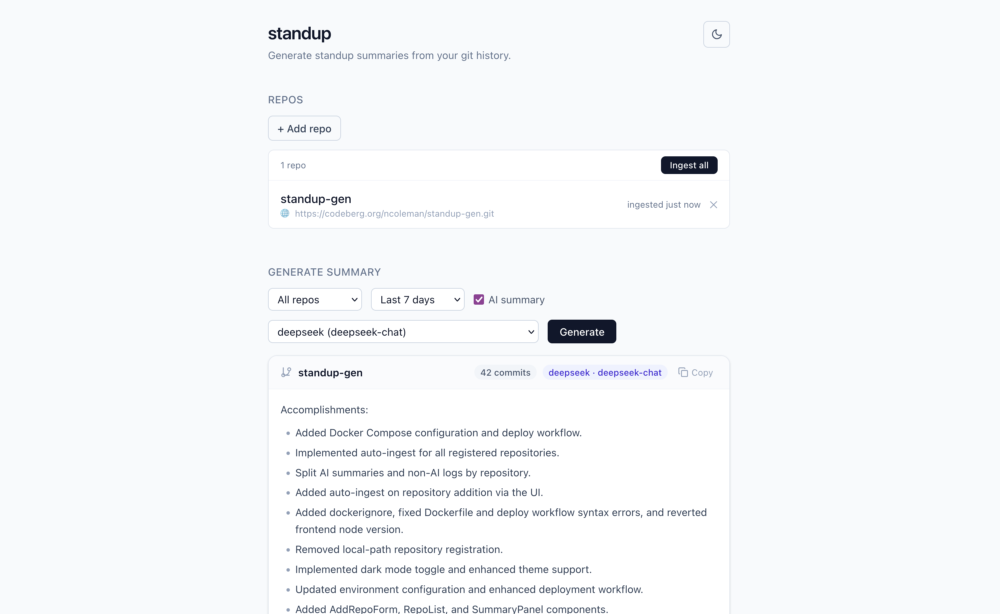
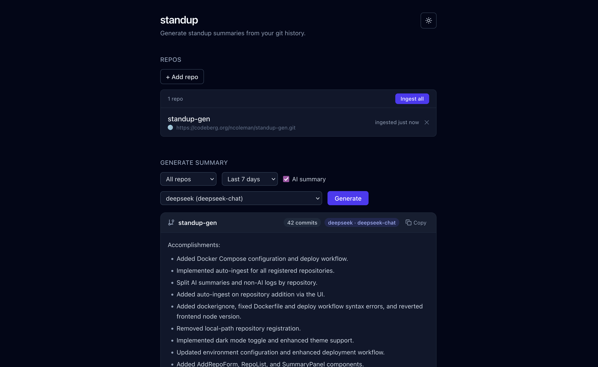

# standup-gen

Generate standup summaries from your git commit history — as a plain formatted log
or an AI-written prose summary. Use it as a one-off CLI, or self-host the small web
app to register repos, ingest commits on a schedule, and grab a copy-pasteable daily
or weekly summary from the browser.

[](LICENSE)


<p align="center">
  
  
</p>

## What it is

Three layers that build on each other; the CLI stays first-class and works on its own:

| Layer | What it does | Status |
| --- | --- | --- |
| **CLI** (`standup`) | Point it at a git repo, get a formatted log or an AI prose summary. No database required. | Working |
| **REST API** (FastAPI + Postgres) | Ingests commits into a `commits` table, exposes filterable read + summary endpoints, and CRUD for registered repos. | Working |
| **Web UI** (SvelteKit) | Register repos, trigger ingests, and generate standup summaries from the browser — light/dark themed. Served same-origin by the API. | Working |

## Quickstart (self-hosted web app)

Runs Postgres + the API + the bundled web UI with one command.

```bash
git clone https://codeberg.org/ncoleman/standup-gen.git
cd standup-gen
cp .env.example .env          # optional: add a provider key for AI summaries
docker compose up --build
```

Then open <http://localhost:8000>. Migrations run automatically on startup.

The app works **without** an LLM key — you'll get formatted commit logs and
non-AI summaries. Add a provider key to `.env` (see [Configuration](#configuration))
to enable AI-written prose summaries.

## CLI (standalone)

The CLI needs no database or server.

1. Install [uv](https://docs.astral.sh/uv/):

   ```bash
   curl -LsSf https://astral.sh/uv/install.sh | sh
   ```

2. Install `standup` as a global command:

   ```bash
   git clone https://codeberg.org/ncoleman/standup-gen.git
   cd standup-gen
   uv tool install .
   uv tool update-shell   # adds uv's tool bin to PATH (once); restart your shell after
   ```

3. (Optional) For AI summaries, set a provider key — e.g. in `~/.zshrc`:

   ```bash
   export ANTHROPIC_API_KEY=your_key_here
   ```

Usage:

```bash
standup /path/to/your/repo --since 1.day.ago --summarize
```

| Flag | Default | Description |
| ---- | ------- | ----------- |
| `repo_path` | *(required)* | Path to the git repository |
| `--since` | `7.days.ago` | How far back to look |
| `--until` | `now` | End of the range |
| `--author` | *(none)* | Filter to a specific author |
| `--since-commit` | *(none)* | Range starting from a given commit |
| `--summarize` | off | Use AI to write a prose summary (needs a provider key) |
| `--output` | *(stdout)* | Write output to a file instead |

## Configuration

Set these in `.env` (web app) or your shell (CLI). Only the provider you actually use
needs a key.

| Variable | Default | Notes |
| --- | --- | --- |
| `DATABASE_URL` | derived from `POSTGRES_*` | Full SQLAlchemy URL. If unset, built from the `POSTGRES_*` vars below. |
| `POSTGRES_HOST` / `_PORT` / `_USER` / `_PASSWORD` / `_DB` | `db` / `5432` / `standup` / `standup` / `standup` | Used to assemble `DATABASE_URL` when it isn't set directly. |
| `LLM_PROVIDER` | `anthropic` | Summary provider: `anthropic`, `groq`, or `deepseek`. |
| `ANTHROPIC_API_KEY` / `GROQ_API_KEY` / `DEEPSEEK_API_KEY` | *(none)* | Key for the chosen provider; required for `--summarize` and `GET /summary?ai=true`. |
| `ANTHROPIC_MODEL` / `GROQ_MODEL` / `DEEPSEEK_MODEL` | per-provider | Optional model overrides (defaults: `claude-haiku-4-5-20251001`, `llama-3.1-8b-instant`, `deepseek-chat`). |
| `STANDUP_USER` | `the developer` | Name injected into the summary prompt. |
| `STANDUP_ROLE` | *(none)* | Optional role description appended to the prompt identity. |
| `API_HOST` / `API_PORT` | `127.0.0.1` / `8000` | Where the API binds. |
| `INGEST_INTERVAL` | `300` | Seconds between automatic background ingests of registered repos. |
| `REPO_CACHE_DIR` | `/var/standup/repos` | Where the app clones registered repos for ingest. |

## API endpoints

- `POST /ingest` — runs `git log` against a repo path and upserts commits
- `GET /commits` — paginated list with `since` / `until` / `author` / `repo` filters
- `GET /commits/{hash}` — lookup by full or prefix hash
- `GET /summary` — aggregate by repo and day; `?ai=true` runs the AI summarizer
  (optional `&provider=anthropic|groq|deepseek`)
- `GET /providers` — list available summary providers and the default
- `GET /repos`, `POST /repos`, `DELETE /repos/{id}`, `POST /repos/{id}/ingest` —
  manage registered repos

## Development

```bash
uv sync --group dev                     # install deps (incl. dev tools)
docker compose up -d db                 # Postgres for local dev
uv run alembic upgrade head             # run migrations
uv run uvicorn backend.api:app --reload # API at http://127.0.0.1:8000
cd frontend && npm install && npm run dev   # frontend dev server (proxies to API)
uv run pytest                           # tests
```

See [AGENTS.md](AGENTS.md) for the full architecture overview, and
[docs/production-readiness-plan.md](docs/production-readiness-plan.md) for the roadmap
to a polished public release.

## Contributing

Contributions are welcome. The project is deliberately minimalist — see the principles
in [AGENTS.md](AGENTS.md). (Contributor guide, issue templates, and a code of conduct
are on the way; see the roadmap.)

The canonical repository is on Codeberg: <https://codeberg.org/ncoleman/standup-gen>.

## License

[MIT](LICENSE) © 2026 Nick Coleman
